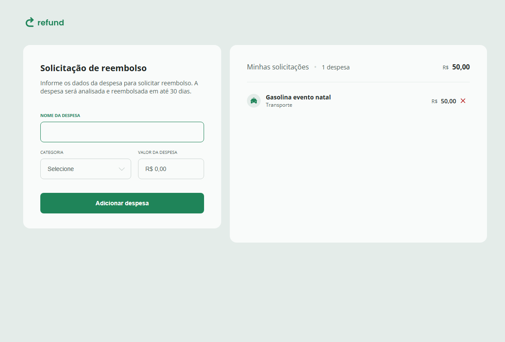
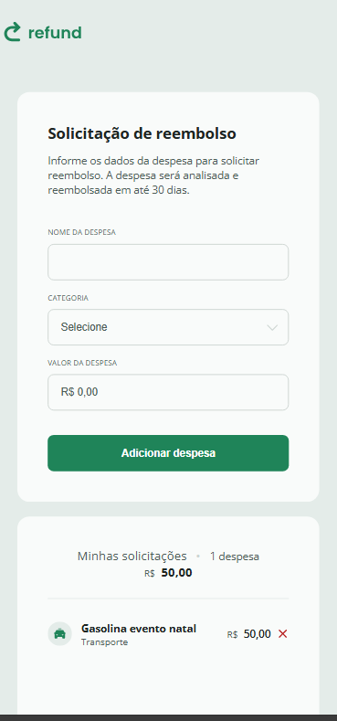

# 💸 Reembolso

Aplicação web para gerenciamento de solicitações de reembolso de despesas.

## 🚀 Demonstração

Acesse a aplicação ao vivo: [https://nikolasmarlon/reembolso/](https://nikolasmarlon.github.io/reembolso/)

## 📸 Capturas de Tela

### 💻 Versão Desktop



### 📱 Versão Mobile



## 🧾 Funcionalidades

- Adição de despesas com nome, categoria e valor.
- Formatação automática de valores monetários.
- Listagem dinâmica das despesas adicionadas.
- Cálculo e exibição do total de despesas.
- Remoção de despesas.

## 🛠️ Tecnologias Utilizadas

- HTML5
- CSS3
- JavaScript (ES6+)

## 📂 Estrutura do Projeto


## 📦 Como Usar

1. Clone o repositório:

   ```bash
   git clone https://github.com/nikolasmarlon/reembolso.git


# 📌 Observações
O projeto é uma aplicação front-end estática, sem backend.

As despesas são armazenadas apenas na sessão atual do navegador.

## 👨‍💻 Autor
Nikolas Marlon

GitHub: @nikolasmarlon

LinkedIn: [Meu Perfil](https://www.linkedin.com/in/nikolasmarlon/)

